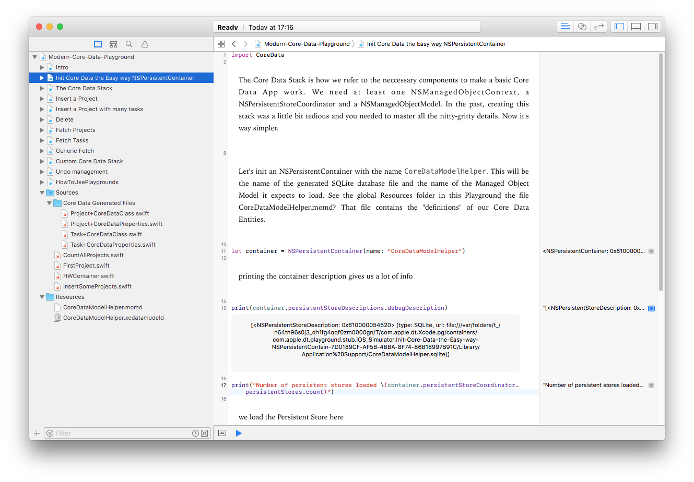

# Modern Core Data Playground: Core Data in Swift 3 / Xcode 8... inside a Playground!

An introduction to Core Data you can test, use, change & code, all in just one Playground!
 


 ## The model used in this example
  
 Core Data wants to be the model of your App, [Markus Zarra](http://martiancraft.com/blog/2015/03/core-data-stack/) once dixit.
 
 So in this Playground we have a simple model:

- you can create __Projects__
- a Project has _name_, _priority_, _startDate_ and several _tasks_
- you can create and add _tasks_ to a _project_
- a __Task__ belongs to just one Project (it's a 1-n relationship, 1 Project can have n Tasks)
- a Task has _desc_ and _title_
 
 ```
|-----------------|               |----------------|
|    Project      |               |     Task       |
|-----------------| 1           n |----------------|
| name: String    |---------------|title: String   |
| priority: Int   |               |desc: String    |
| startDate: Date |               |                |
|-----------------|               |----------------|
 
 ```
 
 - You can browse the model opening the file [CoreDataModelHelper.xcdatamodeld](https://github.com/dfreniche/modern-core-data-playground/CoreDataModelHelper/CoreDataModelHelper/CoreDataModelHelper.xcdatamodeld)
 
 - Xcode 8 creates automagically in `Derived Folder` the Swift classes to represent your Core Data Entities. I've copied them inside the `Sources` folder > `Core Data Generated Files`
 
- for Project Entity, you have `Project+CoreDataProperties.swift`
 
## What you'll find here
 
- how to initialise the Core Data Stack using NSPersistentContainer
- how to create a fine - tuned NSPersistentContainer with a memory-only Core Data Stack
- how to do CRUD operations
- how to fetch, using generics
- how to use the Undo Manager
- ... and more to come


## Requirements
* [Xcode 8](https://developer.apple.com/xcode/downloads/) or greater
* Swift 3

## Installation

Clone the repo and open the playground directly in Xcode.

	$ git clone https://github.com/ && cd CoreDataPlayground
	$ open core-data-playground.playground


## Helper Project

I've used a helper project, just a simple Core Data template App to create the Core Data Model file and to let Xcode generate the Swift source code files for each Entity in that Model.

 ## Getting the mom file
 
 - We can add files to our `Resources` folder (open side Project Navigator with Cmd + 1)
 - In this playground we have a CoreDataModelHelper.xcdatamodel file (not the regular xcdatamodeld directory we use in Core Data projects). This file shows you the Core Data Model of this example.
 - I've run this code in the Simulator and extracted from the App Bundle the compiled version of the xcdatamodel, CoreDataModelHelper.mom, which is the one Core Data loads.

## Acknowledgements

I was wondering if I could run a complete Core Data example inside a Playground. Searching around to see if anyone has tried that before I found [Andrew Shepard's repo on Core Data]( https://github.com/andyshep/CoreDataPlayground.git). This inspired me to create my own, but with a twist: I didn't wanted to create the Managed Object Model in code.

	
## License

The MIT License (MIT)

Copyright (c) 2017 Diego Freniche

Permission is hereby granted, free of charge, to any person obtaining a copy of this software and associated documentation files (the "Software"), to deal in the Software without restriction, including without limitation the rights to use, copy, modify, merge, publish, distribute, sublicense, and/or sell copies of the Software, and to permit persons to whom the Software is furnished to do so, subject to the following conditions:

The above copyright notice and this permission notice shall be included in all copies or substantial portions of the Software.

THE SOFTWARE IS PROVIDED "AS IS", WITHOUT WARRANTY OF ANY KIND, EXPRESS OR IMPLIED, INCLUDING BUT NOT LIMITED TO THE WARRANTIES OF MERCHANTABILITY, FITNESS FOR A PARTICULAR PURPOSE AND NONINFRINGEMENT. IN NO EVENT SHALL THE AUTHORS OR COPYRIGHT HOLDERS BE LIABLE FOR ANY CLAIM, DAMAGES OR OTHER LIABILITY, WHETHER IN AN ACTION OF CONTRACT, TORT OR OTHERWISE, ARISING FROM, OUT OF OR IN CONNECTION WITH THE SOFTWARE OR THE USE OR OTHER DEALINGS IN THE SOFTWARE.
